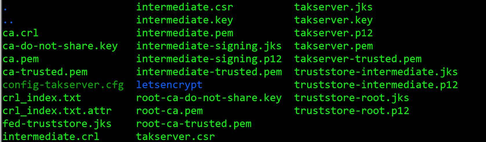

# TAK-Server-Certificate-Enrollment-with-LetsEncrypt-Certs
Set up instructions to use LetsEncrypt Certificates for TAK Server Certificate Enrollment

> **NOTE** LetsEncrypt requires a Fully Qualified Domain Name (FQDN) and will not work with IP addresses)

## 1. INSTALL CERT-BOT
### 1.1. Install `snapd`
1. $ `sudo yum install snapd`
2. $ `sudo systemctl enable --now snapd.socket`
	This needs to be enabled
3. $ `sudo ln -s /var/lib/snapd/snap /snap`

### 1.2. Install `Certbot`
Additional Instructions can be found at:  https://certbot.eff.org/instructions?ws=webproduct&os=centosrhel7 (go with the "standalone" option)
1. $ `sudo snap install core; sudo snap refresh core`
2. $ `sudo snap install --classic certbot`
3. $ `sudo ln -s /snap/bin/certbot /usr/bin/certbot`
4. $ `sudo systemctl stop takserver`
	(If you already have TAK Server running)
5. $`sudo certbot certonly --standalone`
6. $ `sudo systemctl restart takserver`
	(If you have takserver installed already.)
7. $ `sudo yum install -y`

## 2. LetsEncrypt / TAK SERVER:
### 2.1. Enable Access to LetsEncrypt Certs and Conversion
> **NOTE**:  When prompted for a passcode / password, use `atakatak`

> **NOTE**:    or the following section, DOMAIN =the FQDN,and it MUST follow the name exactly as you submitted with certbot. __DOMAIN__ can be what you wish, though for this example / purpose, they are the same.  Pay close attention to when to use periods versus dashes - they are set that way to minimize confusion as to which files to move during the set up. As an example, if your subdomain was "takserver.randomname.com", you would insert "takserver.randomname.com" and "takserver-randomname-com" in lieu of DOMAIN and __DOMAIN__, respectively.

1. $ `sudo -i`
	(to enable access to `/etc/letsencrypt/live/DOMAIN/`)
2. $ `openssl pkcs12 -export -in /etc/letsencrypt/live/DOMAIN/fullchain.pem -inkey /etc/letsencrypt/live/DOMAIN/privkey.pem -name __DOMAIN__ -out ~/__DOMAIN__.p12`
3. $ `keytool -importkeystore -deststorepass atakatak -destkeystore ~/__DOMAIN__.jks -srckeystore ~/__DOMAIN__.p12 -srcstoretype PKCS12`
4. $ `keytool -import -alias bundle -trustcacerts -file /etc/letsencrypt/live/DOMAIN/fullchain.pem -keystore ~/__DOMAIN__.jks`

### 2.2. Copy Certs to /opt/tak/
1. $ `cp ~/__DOMAIN__.jks /opt/tak/certs/files/`
2. $ `cp ~/__DOMAIN__.p12 /opt/tak/certs/files/`
3. $ `cd /opt/tak/certs/files`
4. $ `mv /mv ./__DOMAIN__.jks /letsencrypt`
5. $ ` mv ./__DOMAIN__.p12 /letsencrypt`
6. $ `cd /opt/tak/certs/files/letsencrypt`
7. $ `ls -lah`  (ensure the files appear and that they are owned by `tak` user)\
	if not: $ `sudo chown tak:tak -R /opt/tak/certs/files/letsencrypt`
8. $ `sudo systemctl restart takserver`
---
## 3. Cert Renewal
1. Open / allow port 80 if previously closed
2. $ `sudo systemctl stop takserver`\
		(If you already have TAK Server running)
3. $ `sudo certbot certonly renew --dry-run`\
		(if no errors in #2, then proceed)
3. $ `sudo certbot certonly renew`
4. Then complete section #2 again.

## 4. Setup Certs

> **NOTE**: While you can use whatever names for your certs, even the FQDN, the example below has shown to work whereas using the FQDN (unless expressly stated) was not entirely reliable.

1. `sudo su tak`
2. `cd /opt/tak/certs`
3. `nano cert-metadata.sh`
		- Edit this file accordingly - Especially take note of the names supplied for `O=` (Organization) and `OU=` (Organizational Unit)
4. `./makeRootCa.sh`
		- In this case, **tak-ca** was used.
5. `./makeCert.sh ca`
		- In this case, **intermediate** was used.
6. `./makeCert.sh server` 
		- In this case, **takserver** was used.
7. `cd /opt/tak/certs/files`
8. `exit`
9. `cd /opt/tak/certs/files`
	(If you used the naming convention above, your file list should look like:)

10. `sudo systemctl restart takserver`


## 5. MODIFY CORECONFIG (/opt/tak/CoreConfig.xml)
1. $ `sudo su tak`
2. $ `nano CoreConfig.xml`

### 5.1 Set Port 8089 to x509 authentication (if not already completed):
Locate the `<input...>` tag for `port="8089`" within the `<network>` section and modify it as shown below. 

> **NOTE**: If no input exists for `port="8089"`, then add it below the input(s) for `port="8087"`

```xml
<input auth="x509" _name="cert_enroll" protocol="tls" port="8089" archive="true" anongroup="false" archiveOnly="false"/>
```

### 5.2 Locate `<connector port = "8446" ...> Tag and modify it to reflect the following:

```xml
<connector port="8446" _name="cert_https" truststorePass="atakatak" 
           truststoreFile="certs/files/truststore-intermediate.jks" truststore="JKS" keystorePass="atakatak" 
           keystoreFile="certs/files/letsencrypt/__DOMAIN__.jks" keystore="JKS" 
           clientAuth="false"/>
```

## 6. END USER DEVICE CERTIFICATE ENROLLMENT
### 6.1 ATAK (Android)
When attempting to connect to the takserver with certificate enrollment, you can "add a server" in ATAK or use the Quick Connect feature.  If using the "add server", the following information will be needed:
1. Name:  Whatever you want it to be
2. URL:  DOMAIN
3. Check "Enroll for Client Certficate" (DO NOT CHECK "Use Authentication")

If Using the Quick Connect option, you just need the address (DOMAIN) and the user credentials created TAK Server using the CLI or using the User-Management interface.

### 6.2 iTAK (iOS)
iTAK has two ways to utilize certificate enrollment - adding the server manually or by QR Code.  The information needed for either approach is:
1. Name: [Whatever you want]
2. URL: `DOMAIN`
3. Port:  `8089` (unless you have specified otherwise)
4. Protocol:  `SSL`

For the QR-Code option, generate a text-based QR-Code using the following format for the text:
`Name,DOMAIN,8089,SSL`
